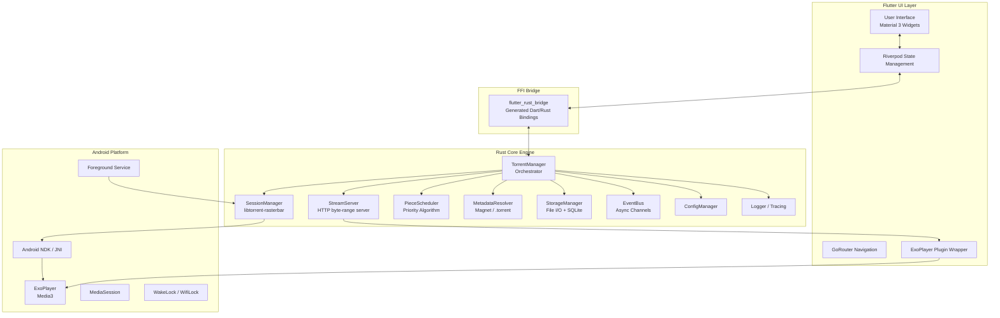
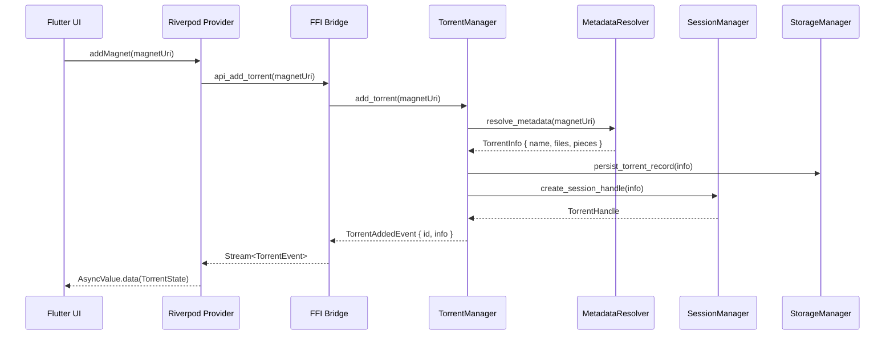
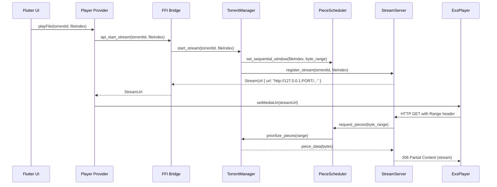
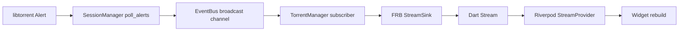
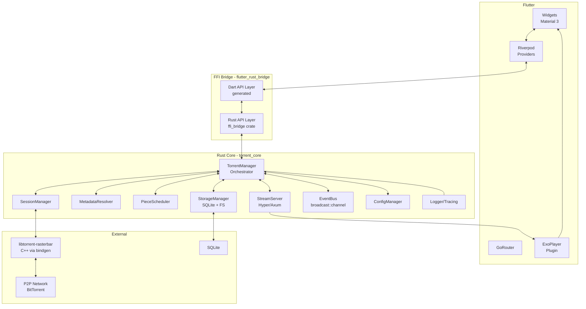
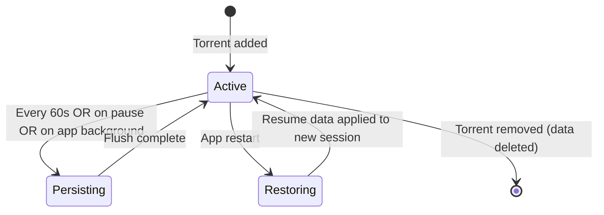
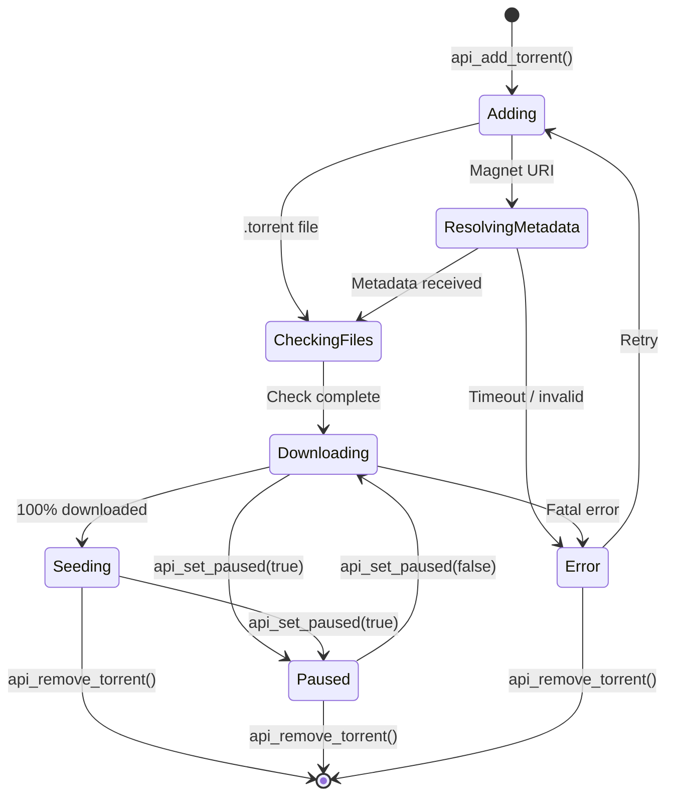
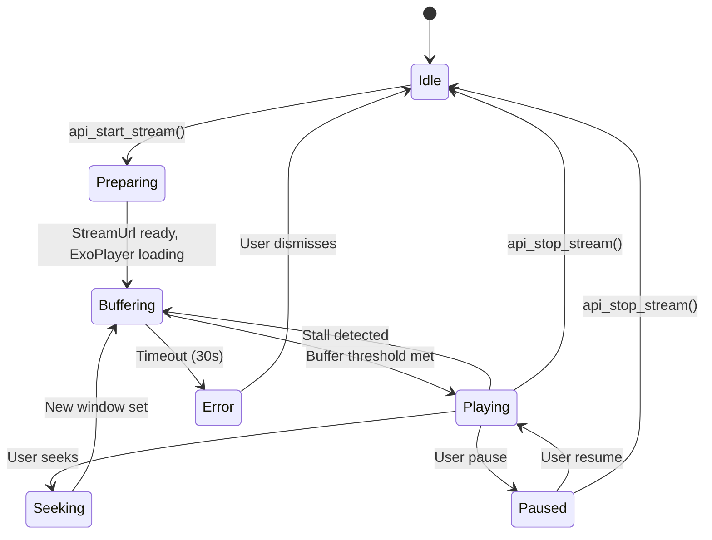
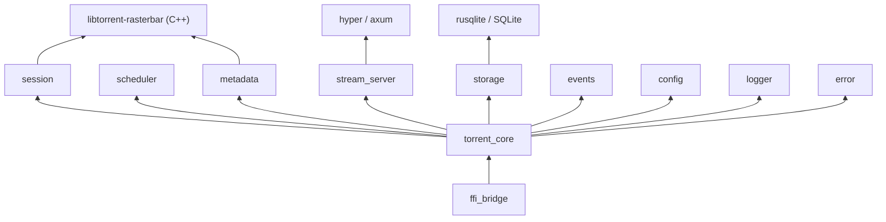

# TorStream — Technical Design Document (TDD)

> **Version:** 1.0.0  
> **Status:** Authoritative Architecture  
> **Scope:** Android-first Torrent Streaming Engine — Flutter UI + Rust Core  
> **Authors:** Phase 0 Architecture Design

---

## Table of Contents

1. [Overall System Architecture](#1-overall-system-architecture)
2. [Module Responsibilities](#2-module-responsibilities)
3. [Folder Structure](#3-folder-structure)
4. [Clean Architecture Layers](#4-clean-architecture-layers)
5. [Data Flow](#5-data-flow)
6. [Component Diagram](#6-component-diagram)
7. [Threading Model](#7-threading-model)
8. [Async Task Architecture](#8-async-task-architecture)
9. [Memory Management Strategy](#9-memory-management-strategy)
10. [Streaming Pipeline](#10-streaming-pipeline)
11. [Buffer Pipeline](#11-buffer-pipeline)
12. [Piece Priority Algorithm](#12-piece-priority-algorithm)
13. [Error Handling Strategy](#13-error-handling-strategy)
14. [Logging Strategy](#14-logging-strategy)
15. [Configuration Management](#15-configuration-management)
16. [Storage Design](#16-storage-design)
17. [Resume Data Design](#17-resume-data-design)
18. [FFI Design](#18-ffi-design)
19. [Android Integration](#19-android-integration)
20. [Testing Strategy](#20-testing-strategy)
21. [Performance Targets](#21-performance-targets)
22. [Security Considerations](#22-security-considerations)
23. [Future Extensibility](#23-future-extensibility)
24. [Coding Standards & Naming Conventions](#24-coding-standards--naming-conventions)

---

## 1. Overall System Architecture

TorStream is a **fully local, peer-to-peer torrent streaming engine** for Android. There is no cloud backend. The user's device downloads, buffers, and streams video simultaneously.



### Design Principles

| Principle | Application |
|-----------|-------------|
| Separation of Concerns | Flutter has zero torrent logic. Rust has zero UI logic. |
| Unidirectional Data Flow | Events flow Rust → Bridge → Riverpod → UI |
| Single Source of Truth | All state owned by Rust; Flutter reflects it |
| Fail-Fast with Recovery | Errors escalate through typed enums with retry paths |
| Zero-Copy where possible | Rust streams bytes directly; no Dart heap copies |

---

## 2. Module Responsibilities

### 2.1 Flutter Modules

| Module | Package Path | Responsibility |
|--------|-------------|----------------|
| `app` | `lib/app/` | App bootstrap, theme, router setup |
| `bridge` | `lib/bridge/` | Auto-generated FRB bindings (do not edit manually) |
| `features/home` | `lib/features/home/` | Torrent list, search entry point |
| `features/player` | `lib/features/player/` | ExoPlayer widget, playback controls |
| `features/add_torrent` | `lib/features/add_torrent/` | Magnet/file input UI |
| `features/settings` | `lib/features/settings/` | User config UI |
| `shared/widgets` | `lib/shared/widgets/` | Reusable UI primitives |
| `shared/providers` | `lib/shared/providers/` | Global Riverpod providers |
| `shared/models` | `lib/shared/models/` | Dart-side view models (pure data) |

### 2.2 Rust Modules

| Crate / Module | Path | Responsibility |
|----------------|------|----------------|
| `torrent_core` | `rust/crates/torrent_core/` | Central orchestration crate |
| `ffi_bridge` | `rust/crates/ffi_bridge/` | FRB API surface (only public types) |
| `session` | `torrent_core/src/session/` | libtorrent session lifecycle |
| `metadata` | `torrent_core/src/metadata/` | Magnet resolution, .torrent parsing |
| `scheduler` | `torrent_core/src/scheduler/` | Piece priority + sequential scheduling |
| `stream_server` | `torrent_core/src/stream_server/` | Local HTTP server for ExoPlayer |
| `storage` | `torrent_core/src/storage/` | File I/O, resume data, SQLite |
| `config` | `torrent_core/src/config/` | App and per-torrent config |
| `events` | `torrent_core/src/events/` | Typed event definitions + channels |
| `logger` | `torrent_core/src/logger/` | `tracing` subscriber init |
| `error` | `torrent_core/src/error/` | Unified error types |

---

## 3. Folder Structure

```
tor_stream/                              # Flutter project root
├── lib/
│   ├── main.dart                        # Entry point
│   ├── app/
│   │   ├── app.dart                     # MaterialApp + providers scope
│   │   ├── router.dart                  # GoRouter configuration
│   │   └── theme.dart                   # Material 3 theme tokens
│   ├── bridge/
│   │   └── generated/                   # FRB auto-generated — DO NOT EDIT
│   │       ├── api.dart
│   │       └── bridge_definitions.dart
│   ├── features/
│   │   ├── home/
│   │   │   ├── presentation/
│   │   │   │   ├── home_screen.dart
│   │   │   │   └── torrent_tile.dart
│   │   │   └── providers/
│   │   │       └── torrent_list_provider.dart
│   │   ├── player/
│   │   │   ├── presentation/
│   │   │   │   ├── player_screen.dart
│   │   │   │   └── playback_controls.dart
│   │   │   └── providers/
│   │   │       └── player_provider.dart
│   │   ├── add_torrent/
│   │   │   ├── presentation/
│   │   │   │   └── add_torrent_screen.dart
│   │   │   └── providers/
│   │   │       └── add_torrent_provider.dart
│   │   └── settings/
│   │       ├── presentation/
│   │       │   └── settings_screen.dart
│   │       └── providers/
│   │           └── settings_provider.dart
│   └── shared/
│       ├── models/
│       │   ├── torrent_state.dart
│       │   ├── file_entry.dart
│       │   └── playback_state.dart
│       ├── widgets/
│       │   ├── progress_bar.dart
│       │   └── speed_indicator.dart
│       └── providers/
│           └── rust_bridge_provider.dart
│
├── rust/
│   ├── Cargo.toml                       # Workspace root
│   ├── Cargo.lock
│   ├── crates/
│   │   ├── torrent_core/
│   │   │   ├── Cargo.toml
│   │   │   ├── build.rs                 # libtorrent linkage
│   │   │   └── src/
│   │   │       ├── lib.rs
│   │   │       ├── error.rs
│   │   │       ├── events.rs
│   │   │       ├── config.rs
│   │   │       ├── logger.rs
│   │   │       ├── session/
│   │   │       │   ├── mod.rs
│   │   │       │   └── handle.rs
│   │   │       ├── metadata/
│   │   │       │   ├── mod.rs
│   │   │       │   └── resolver.rs
│   │   │       ├── scheduler/
│   │   │       │   ├── mod.rs
│   │   │       │   ├── piece_queue.rs
│   │   │       │   └── window.rs
│   │   │       ├── stream_server/
│   │   │       │   ├── mod.rs
│   │   │       │   ├── http_server.rs
│   │   │       │   └── byte_range.rs
│   │   │       └── storage/
│   │   │           ├── mod.rs
│   │   │           ├── db.rs
│   │   │           └── resume.rs
│   │   └── ffi_bridge/
│   │       ├── Cargo.toml
│   │       └── src/
│   │           ├── lib.rs               # #[flutter_rust_bridge] API surface
│   │           ├── api_torrent.rs
│   │           ├── api_stream.rs
│   │           └── types.rs             # Shared FFI-safe types
│   └── targets/                         # Cross-compilation targets
│       ├── aarch64-linux-android.json
│       └── armv7-linux-androideabi.json
│
├── android/
│   ├── app/
│   │   ├── build.gradle.kts             # NDK + ABI filters + Rust .so linking
│   │   └── src/main/
│   │       ├── AndroidManifest.xml      # Permissions + ForegroundService
│   │       ├── kotlin/com/torstream/
│   │       │   ├── MainActivity.kt
│   │       │   ├── TorrentService.kt    # Foreground service
│   │       │   └── PlayerActivity.kt
│   │       └── res/
│   ├── build.gradle.kts
│   └── settings.gradle.kts
│
├── scripts/
│   ├── build_android.sh                 # Full Android build pipeline
│   ├── setup_ndk.sh                     # NDK + Rust target setup
│   └── generate_bridge.sh               # FRB codegen
│
├── .cargo/
│   └── config.toml                      # Cross-compilation linker config
├── pubspec.yaml
├── analysis_options.yaml
└── README.md
```

---

## 4. Clean Architecture Layers

TorStream uses a strict **three-tier clean architecture** per layer (Flutter) and **hexagonal/ports-adapters** (Rust).

### 4.1 Flutter Clean Architecture

```
Presentation Layer         (lib/features/*/presentation/)
    ↓ reads from
State Layer                (lib/features/*/providers/ + lib/shared/providers/)
    ↓ calls
Bridge Layer               (lib/bridge/generated/)
    ↓ FFI calls
Rust Core                  (rust/)
```

**Rules:**
- Widgets **never** call Rust directly — only via Riverpod providers
- Providers hold the only `AsyncValue<T>` state
- Models in `lib/shared/models/` are **pure Dart data classes** (no logic)
- No `BuildContext` in providers

### 4.2 Rust Hexagonal Architecture

```
                    ┌─────────────────────────────────┐
                    │          ffi_bridge crate        │  ← Primary Port (inbound)
                    └──────────────┬──────────────────┘
                                   │
                    ┌──────────────▼──────────────────┐
                    │       torrent_core crate         │  ← Domain / Application
                    │  session │ scheduler │ metadata  │
                    │  stream_server │ storage         │
                    └──────┬──────────────┬────────────┘
                           │              │
             ┌─────────────▼──┐  ┌────────▼───────────┐
             │  libtorrent    │  │  SQLite (rusqlite)  │  ← Secondary Ports (outbound)
             │  (C++ FFI)     │  │  File System I/O    │
             └────────────────┘  └────────────────────┘
```

**Rules:**
- `ffi_bridge` depends on `torrent_core`, never the reverse
- `torrent_core` modules do **not** depend on each other horizontally — they communicate via `EventBus`
- All I/O is async (Tokio)

---

## 5. Data Flow

### 5.1 Add Torrent Flow



### 5.2 Stream Playback Flow



### 5.3 Event Flow (Rust → Flutter)



---

## 6. Component Diagram



---

## 7. Threading Model

### 7.1 Thread Ownership

| Thread/Task | Owner | Pinned? | Notes |
|-------------|-------|---------|-------|
| Tokio runtime threads | Rust | No | Multi-threaded runtime, 4 workers on Android |
| libtorrent I/O thread | C++ (libtorrent) | Yes | Managed internally by libtorrent |
| Alert polling task | Rust async task | No | Polls libtorrent alerts every 100ms |
| HTTP stream server | Tokio task per conn | No | Spawned per ExoPlayer connection |
| Piece scheduler | Tokio task | No | Runs on Tokio thread pool |
| SQLite writes | Tokio blocking pool | Yes (`spawn_blocking`) | SQLite is not async-safe |
| Flutter main thread | Dart VM | Yes | UI only |
| FRB callback thread | Dart isolate | No | FRB-managed, delivers events |

### 7.2 Tokio Runtime Configuration

```rust
// rust/crates/torrent_core/src/lib.rs
fn build_runtime() -> tokio::runtime::Runtime {
    tokio::runtime::Builder::new_multi_thread()
        .worker_threads(4)           // Android: 4 cores typical
        .thread_name("torstream-worker")
        .enable_all()
        .build()
        .expect("Failed to build Tokio runtime")
}
```

### 7.3 Thread Safety Invariants

- All mutable Rust state is behind `Arc<RwLock<T>>` or `Arc<Mutex<T>>`
- libtorrent `session` object is `!Send`; wrapped in a dedicated thread via `std::thread::spawn` with a `mpsc` channel for commands
- No Dart objects cross into Rust memory
- FFI types are all `#[repr(C)]` or primitives — no Dart pointers in Rust

---

## 8. Async Task Architecture

### 8.1 Task Hierarchy

```
TorrentManager::run()                   (long-lived Tokio task)
├── SessionManager::poll_loop()         (alert polling, 100ms interval)
├── EventBus::broadcast_loop()          (fanout to subscribers)
├── StreamServer::accept_loop()         (HTTP connections)
│   └── handle_connection()             (per-request, short-lived)
├── PieceScheduler::window_advance()    (piece window management)
└── StorageManager::flush_loop()        (periodic SQLite flush)
```

### 8.2 Cancellation Strategy

All long-lived tasks receive a `CancellationToken` (from `tokio-util`):

```rust
pub struct TorrentCore {
    cancel: CancellationToken,
    runtime: Runtime,
}

impl Drop for TorrentCore {
    fn drop(&mut self) {
        self.cancel.cancel();  // Signal all tasks to stop
        // Runtime drop waits for tasks to complete
    }
}
```

### 8.3 Backpressure

| Boundary | Strategy |
|----------|----------|
| libtorrent → EventBus | Bounded `broadcast::channel(256)` — old events dropped |
| EventBus → FRB StreamSink | FRB sink is non-blocking; overflow logs a warning |
| ExoPlayer → StreamServer | TCP backpressure (kernel buffer) |
| Piece requests → Scheduler | `mpsc::channel(64)` — bounded queue |

---

## 9. Memory Management Strategy

### 9.1 Rust Memory

- **No GC**. All allocations are stack or heap via `Box<T>`, `Vec<T>`, `Arc<T>`
- Piece data (`Vec<u8>`) is allocated once, passed via reference to HTTP server, dropped after send
- libtorrent piece buffers are released immediately after write
- SQLite WAL mode minimizes in-memory accumulation

### 9.2 Android Memory Targets

| Component | Target Heap | Strategy |
|-----------|------------|---------|
| Rust core (idle) | < 20 MB | No pre-allocation |
| Rust core (streaming) | < 80 MB | Sliding window, piece eviction |
| Flutter UI | < 50 MB | No torrent data in Dart heap |
| ExoPlayer | < 30 MB | ExoPlayer default buffers |
| **Total App Target** | **< 200 MB** | System will not OOM kill |

### 9.3 Piece Eviction Policy

- **Read window**: Keep pieces in memory while they are in the HTTP response window ± 2 pieces
- **Write window**: Keep pieces for up to 5 seconds after libtorrent delivers them
- Beyond window: Release immediately; libtorrent re-requests if needed
- File-mapped I/O (`mmap`) is **not** used on Android due to OOM-killer interaction with anonymous memory

### 9.4 Dart Side

- View models are **immutable** (`@freezed` or `const` constructors)
- No torrent bytes ever cross into Dart — only metadata (name, progress %, speed, ETA)
- Riverpod providers `autodispose` when not observed (e.g., player screen closed)

---

## 10. Streaming Pipeline

```
[BitTorrent Network]
        │
        ▼ (pieces arrive out of order)
[libtorrent-rasterbar]
        │ on_piece_finished alert
        ▼
[SessionManager] → emits PieceReadyEvent { piece_index, data }
        │
        ▼
[PieceScheduler] — assembles contiguous byte range from pieces
        │ notifies when requested range is ready
        ▼
[StreamServer] — serves HTTP/1.1 206 Partial Content
        │
        ▼
[ExoPlayer DataSource] — reads byte-range HTTP
        │
        ▼
[ExoPlayer Decoder] — video/audio decode
        │
        ▼
[Surface / AudioTrack] — render
```

### 10.1 Startup Latency Strategy

1. **Metadata-first**: Resolve torrent info before adding to session
2. **Head pieces first**: Immediately set piece 0..N priority = 7 (libtorrent max)
3. **HTTP server ready before ExoPlayer**: `StreamUrl` is only emitted after server is bound
4. **ExoPlayer buffering**: Configured with 5s min buffer before playback

### 10.2 Seek Support

- On ExoPlayer seek: byte offset → piece index conversion via `offset / piece_size`
- New sequential window set starting at seek position
- Old window pieces deprioritized (priority = 0)
- Seek latency target: < 3 seconds to resume playback

---

## 11. Buffer Pipeline

### 11.1 Buffer Zones

```
Playback Head
     │
     ▼
[Zone A: Immediate] 0 → 30s ahead — Priority 7 (libtorrent max)
[Zone B: Near]     30 → 120s ahead — Priority 5
[Zone C: Far]     120 → 600s ahead — Priority 2
[Zone D: Background] rest of file — Priority 1
[Already played]     behind head — Priority 0 (deprioritized)
```

### 11.2 Byte-to-Piece Mapping

```rust
pub struct PieceWindow {
    piece_length: u64,
    file_offset: u64,       // byte offset within torrent
    file_length: u64,
}

impl PieceWindow {
    pub fn first_piece(&self) -> i32 {
        (self.file_offset / self.piece_length) as i32
    }
    pub fn piece_for_byte(&self, byte_offset: u64) -> i32 {
        ((self.file_offset + byte_offset) / self.piece_length) as i32
    }
}
```

### 11.3 ExoPlayer Buffer Configuration

```kotlin
// PlayerActivity.kt
val loadControl = DefaultLoadControl.Builder()
    .setBufferDurationsMs(
        5_000,    // minBufferMs
        30_000,   // maxBufferMs
        2_500,    // bufferForPlaybackMs
        5_000     // bufferForPlaybackAfterRebufferMs
    )
    .build()
```

---

## 12. Piece Priority Algorithm

### 12.1 Algorithm: Adaptive Sequential Priority

The scheduler runs a **sliding window** over the piece index space of the active file.

**Priority Assignment:**

```
piece_offset = piece_index - playback_head_piece

if piece_offset < 0:         priority = 0   # already played
if piece_offset < immediate: priority = 7   # critical
if piece_offset < near:      priority = 5   # important
if piece_offset < far:       priority = 2   # prefetch
else:                        priority = 1   # background
```

**Window sizes** (in pieces, dynamically adjusted):
- `immediate` = max(8, ceil(30s_worth_of_bytes / piece_size))
- `near` = max(32, ceil(120s_worth_of_bytes / piece_size))
- `far` = max(128, ceil(600s_worth_of_bytes / piece_size))

### 12.2 Playback Head Tracking

ExoPlayer reports position via `player.currentPosition` (Kotlin polling every 2 seconds). This is passed to the Rust scheduler via FFI:

```dart
// player_provider.dart
Timer.periodic(Duration(seconds: 2), (_) {
  final posMs = _exoPlayer.position;
  rustBridge.api_update_playback_position(
    torrentId: id,
    fileIndex: fileIndex,
    positionMs: posMs,
  );
});
```

### 12.3 Stall Detection & Recovery

- If ExoPlayer buffers stall (detected by `Player.STATE_BUFFERING` for > 5s):
  - Immediately elevate all pieces in `immediate` zone to priority 7
  - Temporarily pause `far` zone downloads to free peer slots
  - Emit `StreamEvent::Stall` to Flutter for UI indicator

---

## 13. Error Handling Strategy

### 13.1 Error Type Hierarchy (Rust)

```rust
// rust/crates/torrent_core/src/error.rs

#[derive(Debug, thiserror::Error)]
pub enum TorStreamError {
    #[error("Torrent not found: {id}")]
    TorrentNotFound { id: String },

    #[error("Metadata resolution failed: {reason}")]
    MetadataFailed { reason: String },

    #[error("Stream server error: {0}")]
    StreamServer(#[from] hyper::Error),

    #[error("Storage error: {0}")]
    Storage(#[from] rusqlite::Error),

    #[error("Session error: {0}")]
    Session(String),

    #[error("IO error: {0}")]
    Io(#[from] std::io::Error),

    #[error("Configuration error: {0}")]
    Config(String),
}

pub type Result<T> = std::result::Result<T, TorStreamError>;
```

### 13.2 Error Propagation

```
Rust Error
    └─ TorStreamError (typed)
           └─ Converted to FFI-safe ErrorCode + message string
                  └─ Returned as Dart Exception
                         └─ Caught in Riverpod provider → AsyncValue.error
                                └─ UI shows error widget with retry action
```

### 13.3 Recovery Strategies

| Error | Automatic Recovery | User Action |
|-------|--------------------|-------------|
| Metadata timeout | Retry 3x with exponential backoff | Show manual retry |
| Peer disconnection | libtorrent handles reconnection | None |
| Stream stall | Piece reprioritization | Show spinner |
| SQLite locked | Wait + retry (10 attempts) | Alert if fatal |
| NDK crash | JVM crash handler logs + saves resume data | App restart |
| OOM | Reduce buffer window size | None (automatic) |

---

## 14. Logging Strategy

### 14.1 Rust Logging (tracing)

```rust
// Spans: major operations
#[tracing::instrument(skip(self), fields(torrent_id = %id))]
async fn start_stream(&self, id: &str, file_index: usize) -> Result<StreamUrl> { ... }

// Events: piece milestones
tracing::info!(piece = piece_index, "Piece ready for streaming");
tracing::warn!(stall_duration_ms = duration, "Playback stall detected");
tracing::error!(err = %e, "Stream server error");
```

**Log Levels:**

| Level | Usage |
|-------|-------|
| `ERROR` | Failures requiring user attention |
| `WARN` | Recoverable degraded states |
| `INFO` | Key lifecycle events (torrent added, stream started) |
| `DEBUG` | Per-piece events, connection events |
| `TRACE` | Byte-range calculations, internal state |

**Sink:** `tracing-android` (logcat on Android), rotating file sink in production.

### 14.2 Flutter Logging

- Only Riverpod state transitions are logged (not raw bytes)
- `debugPrint` in debug, `logger` package in profile/release
- No user PII logged

### 14.3 Log Format

```
2026-07-23T07:36:00Z INFO torstream::session start_stream torrent_id="abc123" file_index=0
2026-07-23T07:36:00Z DEBUG torstream::scheduler piece=0 priority=7 zone=immediate
```

---

## 15. Configuration Management

### 15.1 Config Schema

```rust
// rust/crates/torrent_core/src/config.rs

#[derive(Debug, Clone, Serialize, Deserialize)]
pub struct AppConfig {
    pub session: SessionConfig,
    pub streaming: StreamingConfig,
    pub storage: StorageConfig,
    pub network: NetworkConfig,
}

#[derive(Debug, Clone, Serialize, Deserialize)]
pub struct SessionConfig {
    pub max_connections: u32,          // default: 200
    pub max_upload_slots: u32,         // default: 8
    pub upload_rate_limit: i64,        // bytes/s, 0 = unlimited
    pub download_rate_limit: i64,      // bytes/s, 0 = unlimited
    pub dht_enabled: bool,             // default: true
    pub peer_exchange: bool,           // default: true
}

#[derive(Debug, Clone, Serialize, Deserialize)]
pub struct StreamingConfig {
    pub http_port: u16,                // default: 18765 (localhost)
    pub immediate_window_seconds: u32, // default: 30
    pub near_window_seconds: u32,      // default: 120
    pub far_window_seconds: u32,       // default: 600
    pub stall_timeout_ms: u64,         // default: 5000
}

#[derive(Debug, Clone, Serialize, Deserialize)]
pub struct StorageConfig {
    pub download_dir: PathBuf,
    pub cache_dir: PathBuf,
    pub max_cache_gb: f32,             // default: 10.0
    pub resume_data_interval_s: u32,   // default: 60
}

#[derive(Debug, Clone, Serialize, Deserialize)]
pub struct NetworkConfig {
    pub listen_port: u16,              // default: 6881
    pub use_upnp: bool,                // default: true
    pub use_natpmp: bool,              // default: true
}
```

### 15.2 Config Persistence

- Stored as `config.toml` in Android app's `filesDir`
- Loaded at startup; validated against schema
- Hot-reload supported: `ConfigManager::reload()` propagates changes to all modules

### 15.3 Config Source Priority

```
CLI args (future desktop)
    ↑ overrides
Environment variables
    ↑ overrides
config.toml (user)
    ↑ overrides
Compiled defaults
```

---

## 16. Storage Design

### 16.1 SQLite Schema

**Database:** `torstream.db` in `filesDir`

```sql
-- Torrents table
CREATE TABLE torrents (
    id              TEXT PRIMARY KEY,   -- info-hash hex
    name            TEXT NOT NULL,
    magnet_uri      TEXT,
    torrent_file    BLOB,
    status          TEXT NOT NULL,      -- ADDED|DOWNLOADING|SEEDING|PAUSED|ERROR
    added_at        INTEGER NOT NULL,   -- Unix epoch ms
    total_size      INTEGER NOT NULL,
    downloaded      INTEGER DEFAULT 0,
    download_path   TEXT NOT NULL,
    save_path       TEXT NOT NULL
);

-- Files within a torrent
CREATE TABLE torrent_files (
    id              INTEGER PRIMARY KEY AUTOINCREMENT,
    torrent_id      TEXT NOT NULL REFERENCES torrents(id),
    file_index      INTEGER NOT NULL,
    path            TEXT NOT NULL,
    size            INTEGER NOT NULL,
    priority        INTEGER DEFAULT 1,  -- 0=skip, 1=low, 4=normal, 7=high
    UNIQUE(torrent_id, file_index)
);

-- Resume data blobs
CREATE TABLE resume_data (
    torrent_id      TEXT PRIMARY KEY REFERENCES torrents(id),
    data            BLOB NOT NULL,      -- libtorrent bencode resume data
    updated_at      INTEGER NOT NULL
);

-- Playback history
CREATE TABLE playback_history (
    id              INTEGER PRIMARY KEY AUTOINCREMENT,
    torrent_id      TEXT NOT NULL REFERENCES torrents(id),
    file_index      INTEGER NOT NULL,
    last_position_ms INTEGER DEFAULT 0,
    last_played_at  INTEGER NOT NULL,
    UNIQUE(torrent_id, file_index)
);

-- Settings
CREATE TABLE settings (
    key     TEXT PRIMARY KEY,
    value   TEXT NOT NULL
);
```

### 16.2 File System Layout

```
/data/data/com.torstream.app/
├── files/
│   ├── torstream.db          # SQLite database
│   ├── config.toml           # User configuration
│   ├── session.state         # libtorrent session state
│   └── downloads/            # Default download directory
│       └── <torrent-name>/
│           ├── <file1>
│           └── <file2>
└── cache/
    └── resume/               # Temporary resume data (pre-flush)
```

---

## 17. Resume Data Design

### 17.1 Resume Data Lifecycle



### 17.2 Resume Data Format

libtorrent's bencode resume data is stored as-is in the `resume_data.data` BLOB column. This contains:
- Piece availability bitmap
- Download progress per file
- Verified pieces
- Peer history

### 17.3 Resume Data Persistence Strategy

```rust
// Runs every 60s OR on app pause
async fn flush_resume_data(&self, torrent_id: &str) -> Result<()> {
    let handle = self.session.get_handle(torrent_id)?;
    handle.save_resume_data(SaveResumeFlags::FLUSH_DISK_CACHE)?;
    // Alert-driven: on_save_resume_data alert carries the bencoded data
    // Stored to SQLite via spawn_blocking
}
```

### 17.4 Crash Recovery

On startup:
1. Load all torrents from `torrents` table with status != `REMOVED`
2. For each, load resume data from `resume_data` table
3. Re-add to libtorrent session with resume data
4. If resume data missing or corrupt → re-check pieces (libtorrent fastresume = false)

---

## 18. FFI Design

### 18.1 flutter_rust_bridge Principles

- **API surface is minimal**: Only operations the UI needs — no internal types leak
- **All FRB types are value types**: No raw pointers, no lifetimes crossing FFI
- **Async by default**: All FRB functions return `Future<T>` in Dart
- **Events via `StreamSink`**: Rust pushes events; Dart listens as `Stream<TorrentEvent>`

### 18.2 Public API Surface (ffi_bridge)

```rust
// rust/crates/ffi_bridge/src/api_torrent.rs

/// Add a torrent from magnet URI
pub async fn api_add_torrent(magnet_uri: String) -> Result<TorrentInfo> { ... }

/// Remove a torrent (optionally delete files)
pub async fn api_remove_torrent(torrent_id: String, delete_files: bool) -> Result<()> { ... }

/// Pause/resume a torrent
pub async fn api_set_torrent_paused(torrent_id: String, paused: bool) -> Result<()> { ... }

/// Subscribe to torrent events (returns a stream)
pub fn api_torrent_events(sink: StreamSink<TorrentEvent>) -> Result<()> { ... }

/// Get all torrents snapshot
pub async fn api_get_torrents() -> Result<Vec<TorrentInfo>> { ... }
```

```rust
// rust/crates/ffi_bridge/src/api_stream.rs

/// Start streaming a file
pub async fn api_start_stream(
    torrent_id: String,
    file_index: usize,
) -> Result<StreamUrl> { ... }

/// Stop streaming
pub async fn api_stop_stream(torrent_id: String, file_index: usize) -> Result<()> { ... }

/// Report playback position for scheduler
pub fn api_update_playback_position(
    torrent_id: String,
    file_index: usize,
    position_ms: i64,
) { ... }
```

### 18.3 FFI-Safe Types

```rust
// rust/crates/ffi_bridge/src/types.rs

pub struct TorrentInfo {
    pub id: String,
    pub name: String,
    pub total_size: i64,
    pub status: TorrentStatus,
    pub progress: f32,              // 0.0 → 1.0
    pub download_speed: i64,        // bytes/s
    pub upload_speed: i64,          // bytes/s
    pub eta_seconds: Option<i64>,
    pub files: Vec<FileInfo>,
    pub num_peers: i32,
    pub num_seeds: i32,
}

pub struct FileInfo {
    pub index: i32,
    pub path: String,
    pub size: i64,
    pub downloaded: i64,
}

pub struct StreamUrl {
    pub url: String,                // "http://127.0.0.1:18765/stream/..."
    pub content_type: String,       // "video/mp4" etc.
    pub total_length: i64,
}

pub enum TorrentStatus {
    Checking,
    Downloading,
    Seeding,
    Paused,
    Error,
}

pub enum TorrentEvent {
    StateChanged { torrent_id: String, new_status: TorrentStatus },
    ProgressUpdate { torrent_id: String, progress: f32, speed: i64 },
    PieceFinished { torrent_id: String, piece_index: i32 },
    StreamReady { torrent_id: String, file_index: i32 },
    StreamStall { torrent_id: String, file_index: i32 },
    Error { torrent_id: String, message: String },
}
```

### 18.4 FRB Codegen Pipeline

```bash
# scripts/generate_bridge.sh
flutter_rust_bridge_codegen generate \
  --rust-input rust/crates/ffi_bridge/src/lib.rs \
  --dart-output lib/bridge/generated/ \
  --c-output android/app/src/main/jniLibs/bridge.h
```

---

## 19. Android Integration

### 19.1 NDK & ABI Configuration

```kotlin
// android/app/build.gradle.kts
android {
    ndkVersion = "27.2.12479018"   // Pinned NDK version

    defaultConfig {
        ndk {
            abiFilters += listOf("arm64-v8a", "armeabi-v7a", "x86_64")
        }
    }
}
```

**Rust targets mapped to ABI:**

| Android ABI | Rust Target |
|-------------|------------|
| `arm64-v8a` | `aarch64-linux-android` |
| `armeabi-v7a` | `armv7-linux-androideabi` |
| `x86_64` | `x86_64-linux-android` |

### 19.2 .so Library Loading

The compiled Rust library (`libtorrent_core.so`) is placed in:
```
android/app/src/main/jniLibs/
├── arm64-v8a/libtorrent_core.so
├── armeabi-v7a/libtorrent_core.so
└── x86_64/libtorrent_core.so
```

FRB's generated Dart code calls `DynamicLibrary.open('libtorrent_core.so')`.

### 19.3 Foreground Service

Torrents run in a `ForegroundService` to survive app backgrounding:

```kotlin
// android/app/src/main/kotlin/com/torstream/TorrentService.kt
class TorrentService : Service() {
    override fun onStartCommand(intent: Intent?, flags: Int, startId: Int): Int {
        startForeground(NOTIFICATION_ID, buildNotification())
        acquireWakeLock()
        acquireWifiLock()
        return START_STICKY
    }
}
```

**Required AndroidManifest.xml permissions:**
```xml
<uses-permission android:name="android.permission.INTERNET"/>
<uses-permission android:name="android.permission.FOREGROUND_SERVICE"/>
<uses-permission android:name="android.permission.WAKE_LOCK"/>
<uses-permission android:name="android.permission.ACCESS_WIFI_STATE"/>
<uses-permission android:name="android.permission.CHANGE_WIFI_MULTICAST_STATE"/>
<uses-permission android:name="android.permission.POST_NOTIFICATIONS"/>
```

### 19.4 ExoPlayer Integration

```kotlin
// android/app/src/main/kotlin/com/torstream/PlayerActivity.kt
val player = ExoPlayer.Builder(this)
    .setLoadControl(torStreamLoadControl)
    .build()

val mediaItem = MediaItem.fromUri(streamUrl) // http://127.0.0.1:18765/...
player.setMediaItem(mediaItem)
player.prepare()
player.play()
```

ExoPlayer is wrapped as a Flutter plugin (`flutter_exoplayer_bridge`) — a thin platform channel that accepts a URL and reports position changes.

### 19.5 Lifecycle Binding

```
App Launch → MainActivity.onCreate() → init Rust core → start TorrentService
App Background → onPause() → flush resume data → service continues
App Killed → service onTaskRemoved() → flush resume data → service stops
App Restart → MainActivity.onCreate() → restore from SQLite + resume data
```

---

## 20. Testing Strategy

### 20.1 Test Pyramid

```
         ┌───────────────────┐
         │   E2E / Android   │  3 scenarios
         ├───────────────────┤
         │  Integration      │  20 scenarios
         ├───────────────────┤
         │  Flutter Widget   │  50 tests
         ├───────────────────┤
         │  Rust Unit Tests  │  150 tests
         └───────────────────┘
```

### 20.2 Rust Unit Tests

| Module | Test Focus |
|--------|-----------|
| `scheduler` | Piece priority assignment, window advance, seek behavior |
| `stream_server` | HTTP byte-range parsing, 206 response correctness |
| `metadata` | Magnet URI parsing, .torrent decoding |
| `storage` | SQLite CRUD, resume data round-trip |
| `config` | Config serialization, default values, hot-reload |
| `events` | EventBus fanout, backpressure handling |

```bash
# Run all Rust tests
cargo test --workspace
# Run with logging
RUST_LOG=debug cargo test -- --nocapture
```

### 20.3 Flutter Widget Tests

- All screens tested with mocked Riverpod providers
- No real Rust bridge calls in widget tests (provider overrides)
- Test: loading, data, error states for each screen

### 20.4 Integration Tests

- `flutter_test` + `integration_test` package
- Rust core initialized with a **test session** (no real peers)
- Test .torrent files served locally for deterministic piece arrival

### 20.5 E2E Tests (Android)

- Run on Firebase Test Lab (CI)
- Scenarios: Add magnet → metadata resolved → download starts → stream plays
- Screen recordings captured on failure

### 20.6 CI Pipeline (GitHub Actions)

```yaml
jobs:
  rust-test:
    runs-on: ubuntu-latest
    steps:
      - cargo test --workspace

  flutter-test:
    runs-on: ubuntu-latest
    steps:
      - flutter test

  android-build:
    runs-on: ubuntu-latest
    steps:
      - ./scripts/setup_ndk.sh
      - ./scripts/build_android.sh
      - Upload APK artifact
```

---

## 21. Performance Targets

| Metric | Target | Measurement Method |
|--------|--------|--------------------|
| App cold start to UI | < 2s | Android Vitals |
| Magnet → first metadata | < 8s (good peers) | Instrumented log |
| First piece received | < 15s | Instrumented log |
| Playback start from first piece | < 3s | ExoPlayer event |
| Seek response time | < 3s | ExoPlayer event |
| Memory at idle | < 50 MB | Android Profiler |
| Memory during streaming | < 200 MB | Android Profiler |
| CPU at idle (background) | < 2% | Android Profiler |
| CPU during streaming | < 15% | Android Profiler |
| Battery drain (1h streaming) | < 8% | Battery Historian |
| App size (APK) | < 30 MB | Build output |

---

## 22. Security Considerations

### 22.1 Network Security

- Stream server **binds only to `127.0.0.1`** (loopback) — never exposed to network
- Random port assigned if default port 18765 is in use
- No authentication required on local HTTP (only localhost clients)

### 22.2 Data Security

- Downloaded files are stored in app-private storage (`filesDir`) — not accessible to other apps without root
- SQLite database uses WAL mode; no encryption in v1 (encryption planned for v2 with SQLCipher)
- No user credentials are stored

### 22.3 Torrent Content

- TorStream does not evaluate or validate the content type of downloaded files
- Piece hashes are verified by libtorrent (SHA-1 per piece, SHA-256 for v2 torrents)
- Malformed torrent files: rejected with `MetadataFailed` error; no panic

### 22.4 FFI Boundary Safety

- All strings crossing FFI are UTF-8 validated in Rust before use
- Pointer validity checked via FRB-generated wrappers
- No `unsafe` code in `ffi_bridge` crate; `unsafe` blocks in `torrent_core` are isolated to C FFI call sites
- `unsafe` blocks require documented SAFETY comments

### 22.5 Android Permissions

- Only minimum required permissions are requested
- Storage permission: Android 10+ uses scoped storage (`filesDir`) — no `READ/WRITE_EXTERNAL_STORAGE`
- Network permission: `INTERNET` is the only network permission

---

## 23. Future Extensibility

### 23.1 Extension Points

| Feature | Extension Point | Phase |
|---------|----------------|-------|
| Desktop (Windows/macOS/Linux) | Replace `TorrentService` + `PlayerActivity` with platform-specific shells | Phase 5 |
| Watch Party | Add `SyncManager` module to `torrent_core`; add signaling server | Phase 6 |
| AI Subtitles | Add `SubtitleModule` in Rust; integrate Whisper.cpp | Phase 7 |
| Chromecast | Add `CastManager` in Flutter; stream server already HTTP | Phase 4 |
| RSS Feeds | Add `FeedManager` in Rust; new Flutter screen | Phase 4 |
| VPN/Proxy | Configurable proxy in `SessionConfig.proxy` | Phase 3 |
| Streaming search | Add `SearchModule` (Torrentio API client) in Rust | Phase 3 |

### 23.2 Plugin Architecture (Future)

The `ffi_bridge` API is designed to support a plugin interface:

```rust
pub trait TorStreamPlugin: Send + Sync {
    fn on_torrent_added(&self, info: &TorrentInfo);
    fn on_piece_finished(&self, torrent_id: &str, piece: i32);
    fn on_stream_start(&self, url: &str);
}
```

Plugins register with `TorrentManager` and receive lifecycle events without access to internals.

### 23.3 Multi-Torrent Streaming

Current design supports **one active stream at a time** (single ExoPlayer instance). Future:
- Add `StreamRegistry` mapping `(torrent_id, file_index) → StreamHandle`
- PIP (picture-in-picture) mode with a second ExoPlayer
- No architecture change needed — stream server already multi-connection

---

## 24. Coding Standards & Naming Conventions

### 24.1 Rust Conventions

| Item | Convention | Example |
|------|-----------|---------|
| Types, Structs, Enums | `PascalCase` | `TorrentManager`, `StreamUrl` |
| Functions, methods | `snake_case` | `start_stream()`, `get_handle()` |
| Constants | `SCREAMING_SNAKE_CASE` | `MAX_PIECE_PRIORITY` |
| Modules | `snake_case` | `stream_server`, `piece_scheduler` |
| Private fields | `snake_case` | `piece_length`, `file_offset` |
| Error variants | `PascalCase` | `TorrentNotFound`, `MetadataFailed` |
| Lifetimes | single lowercase | `'a`, `'session` |

**Rules:**
- `unwrap()` / `expect()` are banned in library code; allowed in tests with descriptive message
- Every `unsafe` block must have a `// SAFETY:` comment explaining invariants
- `clippy` must pass with `#![deny(clippy::all)]`
- All public items must have `///` doc comments

### 24.2 Dart/Flutter Conventions

| Item | Convention | Example |
|------|-----------|---------|
| Classes | `PascalCase` | `TorrentTile`, `PlayerScreen` |
| Variables, methods | `camelCase` | `torrentId`, `startStream()` |
| Constants | `camelCase` with `const` | `const defaultPort = 18765` |
| Files | `snake_case` | `torrent_tile.dart`, `player_screen.dart` |
| Riverpod providers | `camelCase` + `Provider` suffix | `torrentListProvider` |
| Private members | `_camelCase` | `_counter`, `_handleEvent()` |

**Rules:**
- `flutter analyze` must pass with no warnings
- All widgets accept `const` constructors where possible
- No business logic in `build()` methods — only widget composition
- `//` comments for inline; `///` for public APIs

### 24.3 File Naming

| Type | Naming | Example |
|------|--------|---------|
| Rust source | `snake_case.rs` | `piece_scheduler.rs` |
| Dart source | `snake_case.dart` | `torrent_list_provider.dart` |
| Kotlin source | `PascalCase.kt` | `TorrentService.kt` |
| Shell scripts | `snake_case.sh` | `build_android.sh` |
| Config files | `snake_case.toml/yaml` | `config.toml` |

### 24.4 Branch & Commit Strategy

```
main                    → always deployable
├── phase/1-scaffold    → Phase 1 work
├── phase/2-engine      → Phase 2 work
└── feature/XXX-name    → Individual features
```

**Commit format:** `type(scope): description`
- `feat(scheduler): add adaptive window sizing`
- `fix(stream): handle seek past EOF`
- `chore(ci): add Android build step`

---

## Appendix A: Torrent Lifecycle State Machine



## Appendix B: Streaming Lifecycle State Machine



## Appendix C: Module Dependency Graph



---

*End of Technical Design Document v1.0.0*
